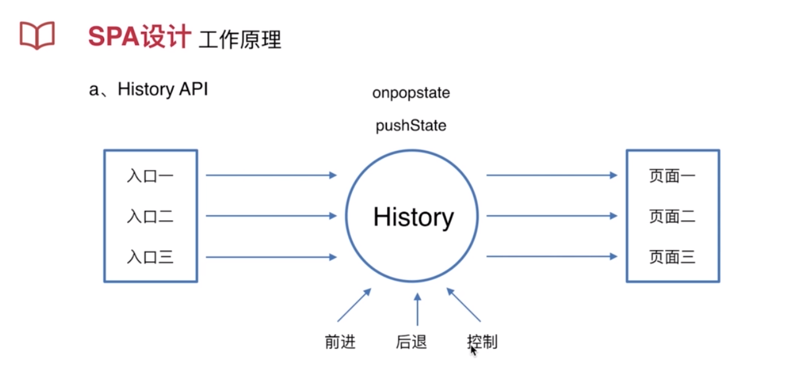
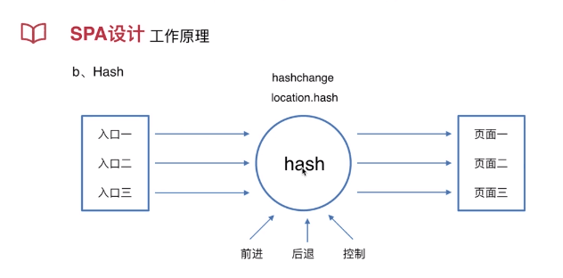

* three.js的彩图示例：
https://www.packtpub.com/sites/default/files/downloads/2215OS_Graphics.pdf

* 前端博客：
http://codingfishman.github.io
http://codingfishman.github.io/2016/05/06/prerender%E9%A2%84%E6%B8%B2%E6%9F%93%E4%BC%98%E5%8C%96SEO/

# 项目设计与原理分析

* 1、设计意义
    1. 前后端分离
    2. 减轻服务器压力
    3. 增强用户体验
    4. Prerender预渲染优化SEO
    
* 2、工作原理
    1. History API 
    2. Hash
history对象的pushState创建一个历史，onpopstate：响应前进后退    

面试问到：
1、spa怎么实现的？
答：spa做了哪些事？他是怎么做到的。

web前端组左佳怡工作日报：
1、任务：DT-740(进行中)
2、链接：http://10.10.10.10:1111/secure/RapidBoard.jspa?rapidView=42&view=detail&selectedIssue=DT-740
3、增加es6案例，以及typescript的案例。

web前端组左佳怡工作日报：
1、任务：DT-847(进行中)
2、链接：http://10.10.10.10:1111/secure/RapidBoard.jspa?rapidView=42&view=detail&selectedIssue=DT-847
3、备课：UI课程代码部分

周报：
1.本周工作内容：备课UI的jq代码，3月8号 磨课50分钟
2.下周工作计划：备课内容需要再整理总结思路，继续磨课
3.其它问题 ：无
备课：UI代码 
磨课：3月8号 磨课50分钟