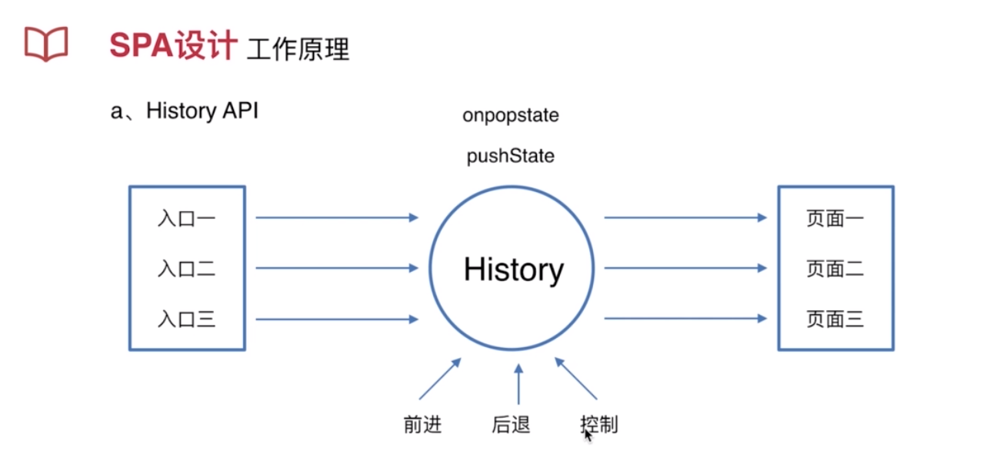
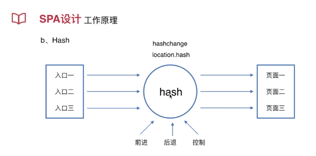

###Welcome to use MarkDown

## 项目设计与原理分析
### css模块化设计
### JS组件设计
### 自适应
### SPA设计
### 构建设计
### 上线指导

### 4-1 css模块化设计 设计原则
* a、可复用能继承要完整
* b、周期性迭代

正确的做法是：今天设计了5个模块，明天有了新的需求的时候我会反思，我之前的模块是需要合并还是需要增加。用迭代的方式控制着代码质量，让模块化设计更加规范和完美
#### css模块化设计 设计方法
* a、先整体后部分再颗粒化
布局：做模块抽象出来 
页面：根据产品需求我需要多少页面，页面又怎么样去区分和隔离样式。AB页面样式相似很多，需要去考虑如何抽离拆分模块化
功能：例如按钮，样式不一样，他是可继承的也是可覆盖的。
业务：具体某一项功能、逻辑、交互。移动端有一个返回的东西，返回在形式上就是一个按钮或者一个链接。回退就是刚才说的功能组件，到业务上要继承功能组件的UI，但是要有自己的业务。

* 先抽象再具体
抽象是说：将一些看着长的不一样的东西抽象成一个统一的模块。这个模块通过隐藏、变量配置来达到具体的内容。
例如：面板：标题+容器，有的可以看做是没有标题的。可以抽象出一个列表的东西，列表可以通过一个配置项来控制他是横向的还是纵向的。列表中填充的内容又具体到了不同的东西。列表是通用的，横向列表填充内容之后就是第一个面板和第四个面板

这里书写了3个大的模块：reset.scss/layout.scss/element.scss
global的方式：
``
scope的方式：
``
当你想用相同的名称例如btn，但是样式不一样，这时候使用css module，通过global和scope的方式就实现了模块的复用继承以及私有化

### 4-2 css模块化设计（代码）

### 4-3 js组件化及自适应
> js组件设计 设计原则
* 高内聚低耦合
高内聚：详细的交互要封装在组件本身，不要被其他组件所控制，这样才能达到最高效的复用
低耦合：首页5个入口和白条页的白条福利看起来都是列表，只不过一个是横向的一个是纵向的，把他们抽象成一个js列表组件，但是这个组件不包括任何功能。
他们两者都复用了这个抽象组件，但是他们两个之间没有任何关系，这就叫低耦合
* 周期性迭代 
学习和实践，反复迭代探索，才能知道什么设计才是最适合自己的业务的。
> js组件设计 设计方法
* a、先整体后部分再颗粒化
    例如：将8个设计成一行 再用 flex换行
    实际操作：继承了抽象组件，再把组件实例化，也就是做到了颗粒化，达到了业务上的实现，这就算业务上的开发完成
* b、尽可能的抽象
    例如：抽象成为一个item，这个item中可以放图片文字等等
    将组件抽象到放任何东西都可以的地步，那你的代码的复用性就非常强了
> 自适应
* 1、基本概念
  * a、css像素、设备像素（和硬件相关一个像素点就是一个像素点）、逻辑像素和css像素是一回事、设备像素比
  * b、viewport
  * c、rem 工作原理？
* 2、工作原理
  * a、利用viewport和设备像素比调整基准像素
  * b、利用px2rem自动转换css单位
  * c、利用viewport和设备像素比调整基准像素
> Retina:一个逻辑像素需要2个物理像素点来显示。一个css像素=2个像素点
> 设备像素比：就是css像素和物理像素的比值
> viewport中width=device-width的背后做了什么？工作原理是什么？如果不设置，手机根本放不下页面。ideal viewport=layout viewport
> viewport分3类？layout viewport是你写的页面最大的，页面的窗口  ideal 手机上被裁减出能看到的这一块就叫
移动设备上的浏览器都会把自己默认的viewport设为980px，把这个浏览器默认的viewport叫做 layout viewport。这个layout viewport的宽度可以通过 document.documentElement.clientWidth 来获取。
visual viewport的宽度可以通过window.innerWidth 来获取
ideal viewport，也就是第三个viewport——移动设备的理想viewport。

> 抛出问题：
1. 设计稿是不是一份，你的代码是不是一份?
2. 你所有设备的兼容性是不是完美的？你怎么做到在不同设备上按尺寸大小自动的去缩放？

### 4-4 spa设计 项目设计与原理分析
* 1、设计意义
    1. 前后端分离           前端做业务逻辑 后端处理数据和接口 不用耦合起来
    2. 减轻服务器压力    每一个页面不用每次都去请求服务端，当一个应用比较复杂，有10几个页面的时候，每一个用户操作几个页面只需要请求一次
    3. 增强用户体验       首页点击详情页时，请求完首页后再去请求详情页，每一次链接都要消耗DNS以及TCP建立链接再加上页面传输的过程还有接口响应的时间。使用单页面不存在多次下载页面的时间，只有接口耗费的时间
    4. Prerender预渲染优化SEO
> 预渲染优化：
http://codingfishman.github.io/2016/05/06/prerender%E9%A2%84%E6%B8%B2%E6%9F%93%E4%BC%98%E5%8C%96SEO/
    
* 2、工作原理
    1. History API 
    2. Hash
    

> History API 更加优雅但是对浏览器有要求
  1.能执行一个打开的动作：点击 入口二 打开 页面二 ，这里要页面二打开是不要请求服务端，而是通过本地js去控制
  2.要有历史记录操作单：当浏览器点击了前进后退或其它控制，他怎么回到对应的页面上去
history对象的pushState创建一个历史，onpopstate：响应前进后退    

> hash不太优雅，但是兼容性最好的方案

当去改变一个地址的时候，修改hash，然后监听hashchange事件，就知道页面地址发生了变化，然后在时间里边去做相应的动作

面试问到：
1、spa怎么实现的？
答：spa做了哪些事？他是怎么做到的。

### 4-5 构建工具及上线指导
webpack：配置 安装 plugin
Babel：vue+es6 配置 安装 loader(webpack的loader)也有babel的工作在里面
webpack的dev-server：配置、安装、热更新、页面的渲染和服务、怎么定义模板、端口怎么配置

